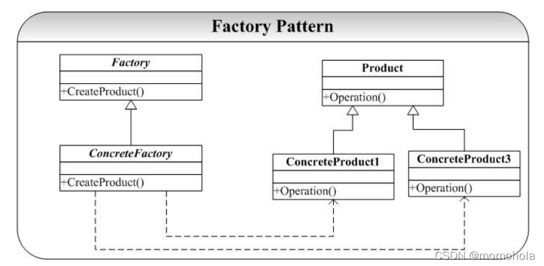

<div align="center">

<h3 align="center"><strong>设计模式 C++</strong></h3>

</div>

- [设计模式概述](#设计模式概述)
- [设计模式七大原则](#设计模式七大原则)
- [设计模式特点](#设计模式特点)
- [Singleton 模式（ 单例模式）](#singleton-模式-单例模式)
- [Factory 模式（工厂模式）](#factory-模式工厂模式)

## 设计模式概述
设计模式是软件开发人员在软件开发过程中面临的一般问题的解决方案。这些解决方案是众多软件开发人员经过相当长的一段时间的试验和错误总结出来的解决某一类问题的一种编码方案。
## 设计模式七大原则
都是为了更好的代码重用性，可读性，可靠性，可维护性，可扩展性。

- 单一职责原则：  
即一个类应该只负责一项职责，降低类的复杂度，免得改了一个影响另一个。提高类的可读性，可维护性，降低变更引起的风险。插件机制的各个插件模块就是一种单一职责。

- 开闭原则：  
 一个软件实体如类，模块和函数应该对扩展开放，对修改关闭。用抽象构建框架，用实现扩展细节。当软件需要变化时，尽量通过扩展软件实体的行为来实现变化，而不是通过修改已有的代码来实现变化。插件机制不正好的这个原则的实现吗。

- 迪米特法则：  
一个对象应该对其他对象保持最少的了解。类与类关系越密切，耦合度越大。
 迪米特法则又叫最少知道原则，即一个类对自己依赖的类知道的越少越好。也就是说，对于被依赖的类不管多么复杂，都尽量将逻辑封装在类的内部。对外除了提供的public 方法，不对外泄露任何信息。插件机制的实现是这一法则很好的诠释。

- 接口隔离原则：  
客户端不应该依赖它不需要的接口，一个类对另一个类的依赖应该建立在最小的接口上。后面的插件实现过程可以看到，插件所提供的接口是精简和必要的最小单元。

- 依赖倒转原则：  
高层模块不应该依赖低层模块，二者都应该依赖其抽象；抽象不应该依赖细节，细节应该依赖抽象。依赖倒置原则基于这样一个事实：相对于细节的多变性，抽象的东西要稳定的多。以抽象为基础搭建的架构比以细节为基础的架构要稳定的多。插件机制的实现上，插件提供的接口可以看作是一种高层模块，不依赖于底层实现细节。

- 里氏替换原则：  
所有引用父类的地方必须能透明地使用其子类的对象，子类对象能够替换父类对象，而程序逻辑不变。根据这个理解，引申含义为：子类可以扩展父类的功能，但不能改变父类原有的功能。

- 合成复用原则：  
该原则阐述的是我们应该如何复用类。复用类我们可以通过“继承”和“合成”两种方式来实现。它最大的缺点就是增加了类之间的依赖，当父类发生改变时，其子类也会被动发生改变。介于继承存在的这些缺点，我们在复用类时，要优先考虑使用“合成”进行复用。合成复用原则的核心思想是：在编写代码时如果需要使用其它类，那么两个类之间尽量使用合成/聚合的方式，而不是使用继承。我们可以通过类之间的“合成”来达到“复用”代码的诉求。

## 设计模式特点
<table>
	<tr>
	    <th>类型</th>
	    <th>设计模式</th>
	    <th>描述</th>
	</tr >
	<tr >
	    <td rowspan="5">创建型</td>
	    <td>Factory 模式</td>
        <td>被实例化的子类</td>
	</tr>
	<tr>
	    <td>AbstactFactory 模式</td>
	    <td>产品对象家族</td>
	</tr>
	<tr>
	    <td>Singleton 模式</td>
	    <td>针对一个类的唯一实例</td>
	</tr>
	<tr>
	    <td >Builder 模式</td>
	    <td>如何创建一个组合对象</td>
	</tr>
    <tr>
	    <td >Prototype 模式</td>
	    <td>针对被实例化的类</td>
	</tr>
    <tr >
	    <td rowspan="4">结构型</td>
	    <td>Composite 模式</td>
        <td>一个对象的结构和组成</td>
	</tr>
    <tr>
	    <td >Flyweight 模式</td>
	    <td>对象的存储开销</td>
	</tr>
    <tr>
	    <td >Facade 模式</td>
	    <td>对一个子系统的接口</td>
	</tr>
    <tr>
	    <td >Proxy 模式</td>
	    <td>如何访问一个对象；该对象的位置</td>
	</tr>
    <tr >
	    <td rowspan="11">行为型</td>
	    <td>Template 模式</td>
        <td>对算法中的某些步骤</td>
	</tr>
    <tr>
	    <td >Strategy 模式</td>
	    <td>算法</td>
	</tr>
    <tr>
	    <td >State 模式</td>
	    <td>对象的状态</td>
	</tr>
    <tr>
	    <td >Observer 模式</td>
	    <td>对多个对象依赖于另外一个对象，而这些对象又如何保持一致</td>
	</tr>
    <tr>
	    <td >Memento 模式</td>
	    <td>对一个对象中哪些私有信息存放在该对象之外，以及在对什么时候进行存储</td>
	</tr>
    <tr>
	    <td >Mediator 模式</td>
	    <td>对象间怎样交互、和谁交互</td>
	</tr>
    <tr>
	    <td >Command 模式</td>
	    <td>何时、怎样满足一个请求</td>
	</tr>
    <tr>
	    <td >Visitor 模式</td>
	    <td>某些可作用于一个（组）对象上的操作，但不修改这些对象的类</td>
	</tr>
    <tr>
	    <td >Chain of Responsibility 模式</td>
	    <td>满足一个请求的对象链</td>
	</tr>
    <tr>
	    <td >Iterator 模式</td>
	    <td>如何遍历、访问一个聚合的各元素</td>
	</tr>
    <tr>
	    <td >Interpreter 模式</td>
	    <td>对一个语言的文法及解释</td>
	</tr>
</table>

## Singleton 模式（ 单例模式）
Singleton 模式是设计模式中最为简单、最为常见、最容易实现，也是最应该熟悉和掌握的模式。Singleton 模式就是一个类只创建一个唯一的对象，即一次创建多次使用。

<strong>实现单例模式的步骤：</strong>  
1、构造函数私有化  
2、增加静态私有的当前类的指针变量  
3、提供静态对外接口,可以让用户获得单例对象


<strong>单例分为懒汉式和饿汉式</strong>  
1、懒汉式：解决了饿汉式内存浪费问题，但是线程不安全的，可以通过互斥量mutex.lock()和mutex.unlock()来解决  
2、饿汉式：还没有使用该单例对象，该单例对象就已经被加载到内存了，在对象过多时会造成内存浪费

<strong>代码：</strong>
```c++
#include <iostream>
using namespace std;

class A {
public:
    static A* getInstace() {
        return a;
    }

private :
    A() {
        a = new A;
    }
    static A* a; 
};
A* A::a = NULL;

//懒汉式   对象的创建在第一次调用getInstance函数时创建
//懒汉式是线程不安全的
class SingletonLazy {
public:
    static SingletonLazy* getInstance() {
        if (pSingleton == NULL) {
            pSingleton = new SingletonLazy;
        }
        return pSingleton;
    }
private:
    SingletonLazy() {}
    static SingletonLazy* pSingleton;
};
//在类外面进行初始化
SingletonLazy* SingletonLazy::pSingleton=NULL;


//饿汉式    对象在程序执行时优先创建
//饿汉式是线程安全的
class SingletonHungry {
public:
    static SingletonHungry* getInstance() {
        return pSingleton;
    }

    static void freeSpace() {
        if (pSingleton != NULL) {
            delete pSingleton;
        }
    }
private:
    SingletonHungry() {}
    static SingletonHungry* pSingleton;
};
//以下语句将会在main函数运行前执行
SingletonHungry* SingletonHungry::pSingleton=new SingletonHungry;


void test01() {
    SingletonLazy* p1 = SingletonLazy::getInstance();
    SingletonLazy* p2 = SingletonLazy::getInstance();
    if (p1 == p2) {
        cout << "单例模式" << endl;
    }
    else {
        cout << "不是单例模式" << endl;
    }
    SingletonHungry* p3 = SingletonHungry::getInstance();
    SingletonHungry* p4 = SingletonHungry::getInstance();
    if (p3 == p4) {
        cout << "单例模式" << endl;
    }
    else {
        cout << "不是单例模式" << endl;
    }
}
int main()
{
    test01();
}
```
<strong>总结：</strong>  
1、Singleton 不可以被实例化，因此将其构造函数声明private  
2、Singleton 模式经常和 Factory（AbstractFactory）模式在一起使用，因为系统中工厂对象一般来说只要一个


## Factory 模式（工厂模式）
在面向对象系统设计中经常可以遇到以下的两类问题：  
- 我们经常会抽象出一些类的公共接口以形成抽象基类或者接口。这样我们可以通过声明一个指向基类的指针来指向实际的子类实现，达到了多态的目的。所以就不得不在要用到子类的地方写new 对象。这样实体类的使用者必须知道实际的子类名称，以及会使程序的扩展性和维护变得越来越困难。  
- 还有一种情况就是在父类中并不知道具体要实例化哪一个具体的子类。只能在父类中写方法调用，具体调用哪一个类的方法交给子类实现。

以上两个问题也就引出了 Factory 模式的两个最重要的功能：  
1、定义创建对象的接口，封装了对象的创建。  
2、使得具体化类的工作延迟到了子类中。

<strong>举例：</strong>  

```c++
//Product.h 
#ifndef _PRODUCT_H_ 
#define _PRODUCT_H_ 
class Product 
{ 
public: 
virtual ~Product() = 0; 
 
protected: 
 Product(); 
private: 
}; 
class ConcreteProduct:public Product 
{ 
public: 
 ~ConcreteProduct(); 
 ConcreteProduct(); 
 
protected: 
private: 
}; 
#endif //~_PRODUCT_H_


//Product.cpp 
#include "Product.h" 
#include <iostream> 
using namespace std; 
Product::Product() 
{ 
 
} 
Product::~Product() 
{ 
} 
ConcreteProduct::ConcreteProduct() 
{ 
 cout<<"ConcreteProduct...."<<endl; 
} 
ConcreteProduct::~ConcreteProduct() 
{ 
}

 
//Factory.h 
#ifndef _FACTORY_H_ 
#define _FACTORY_H_ 
class Product; 
class Factory 
{ 
public: 
virtual ~Factory() = 0;
virtual Product* CreateProduct() = 0; 
protected: 
 Factory(); 
private: 
class ConcreteFactory:public Factory
{ 
public: 
 ~ConcreteFactory(); 
 ConcreteFactory(); 
 Product* CreateProduct(); 
protected: 
private: 
}; 
#endif //~_FACTORY_H_ 

//Factory.cpp 
#include "Factory.h" 
#include "Product.h" 
#include <iostream> 
using namespace std; 
Factory::Factory() 
{ 
} 
Factory::~Factory() 
{
} 
ConcreteFactory::ConcreteFactory() 
{ 
 cout<<"ConcreteFactory....."<<endl; 
} 
ConcreteFactory::~ConcreteFactory() 
{ 
} 
Product* ConcreteFactory::CreateProduct() 
{ 
return new ConcreteProduct(); 
} 

//main.cpp 
#include "Factory.h" 
#include "Product.h"
#include <iostream> 
using namespace std; 
int main(int argc,char* argv[])
{ 
Factory* fac = new ConcreteFactory(); 
Product* p = fac->CreateProduct(); 
 return 0;
} 
```
<strong>总结：</strong>  
- 如果为每一个具体的 ConcreteProduct 类的实例化提供一个函数体，那么我们可能不得不在系统中添加了一个方法来处理这个新建的
ConcreteProduct  
- 可以看出，Factory 模式对于对象的创建给予开发人员提供了很好的实现策略，但是Factory 模式仅仅局限于一类类（就是说
Product 是一类，有一个共同的基类），如果我们要为不同类的类提供一个对象创建的接口，那就要用 AbstractFactory 了。